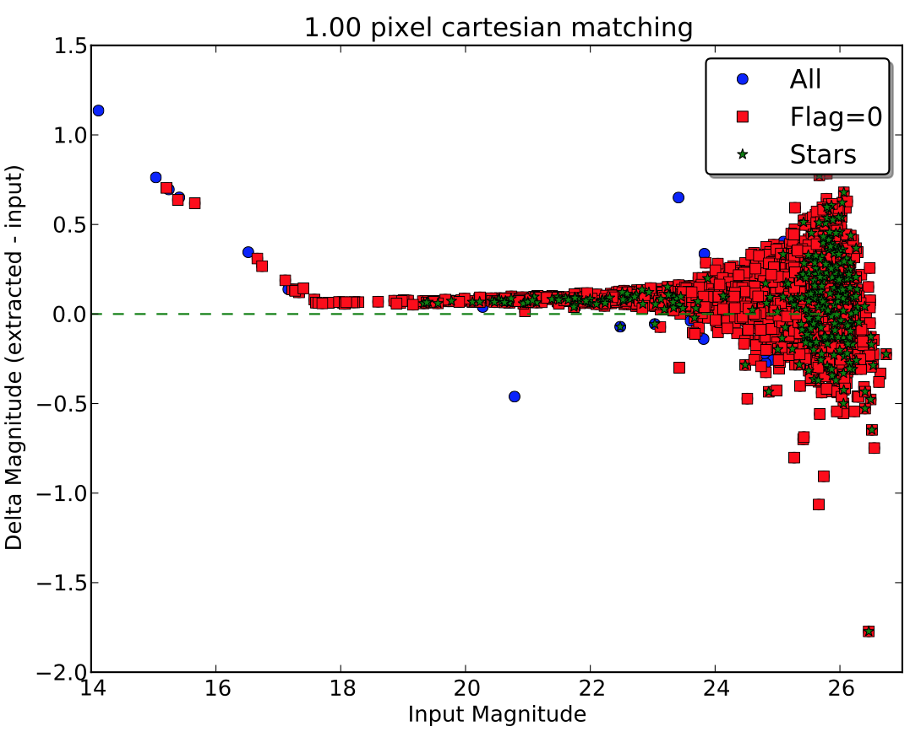
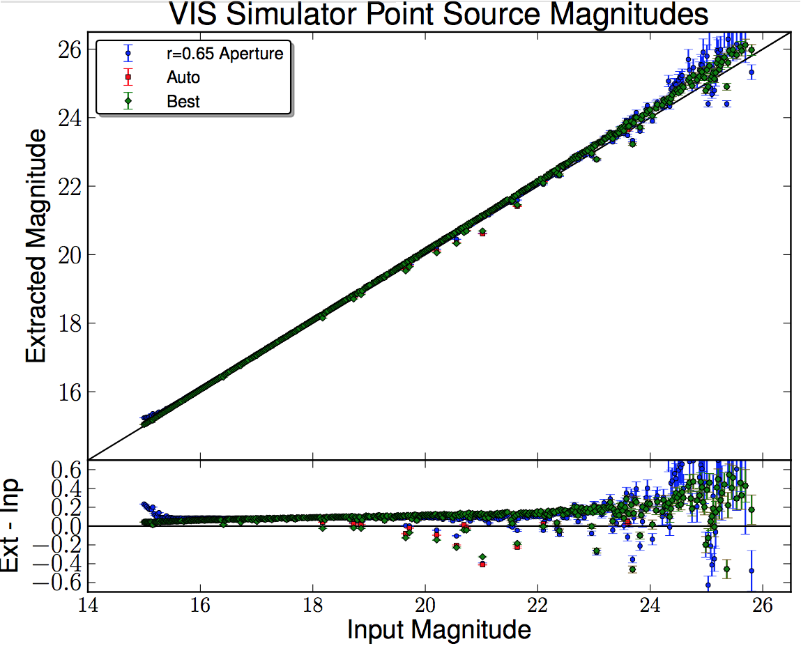

Welcome to Euclid Visible InStrument (VIS) Python Package (VIS-PP) Documentation
================================================================================

:Author: Sami-Matias Niemi
:Contact: s.niemi@icloud.com
:issue: 1.2
:version: 1.4
:date: 5th of March 2015

This Python package VIS-PP provides subpackages and methods related to generating mock data and reducing it, the main
consideration being the visible instrument (VIS) that is being developed for the Euclid telescope.
The subpackages include methods to e.g. generate object catalogues, simulate VIS images,
study radiation damage effects and fit new trap species, reduce and analyse data, and to include instrumental
characteristics such as readout noise and CTI to "pristine" images generated with e.g. the GREAT10 photon
shooting code. In addition, an algorithm to measure ellipticities of galaxies is also provided. Thus,
this package tries to provide an end-to-end simulation chain for the VIS instrument.

The documentation is also available in PDF format, please download the `VIS Python Package Manual <https://www.mssl.ucl.ac.uk/~smn2/Manual.pdf>`_.

Installation
============

The VIS Python Package (VIS-PP) is held in a GIT repository. The package contains a mixture of classes
and scripts divided in subpackages based on the usage. Unfortunately, there is no official or preferred
installation instructions yet. To get most scripts working you should place
the path to the root directory of the package to your PYTHONPATH environment variable. In addition, it is
useful to compile the Fortran code available in the fortran subdirectory with the following command::

    f2py -c -m cdm03 cdm03.f90

and then copy the .so file to the CTI directory. Please note that f2py is available in the NumPy package,
but you still need for example gFortran compiler to actually compile the Fortran source.

Dependencies
------------

The VIS Python package depends heavily on other Python packages such as NumPy, SciPy, PyFITS, and matplotlib.

Instrument Model
================

The *support* subpackage contains functions that define the VIS instrument model. This model contains information
about noise, dark, cosmic rays, radiation damage parameters, sky background, and pixel scale. 

Instrument Characteristics
--------------------------

The *postproc* subpackage contains methods related to either generating a CCD mosaics from simulated data
that is in quadrants like the VIS reference simulator produces or including instrument characteristics
to simulated images that contain only Poisson noise and background.

Exposure Times
==============

The package provides a simple exposure time calculator (ETC) that allows to estimate a signal-to-noise ratio
of an average galaxy or star with a given number of VIS exposures. The ETC also allows to calculate limiting
magnitude or an exposure time for a given magnitude.

Creating Object Catalogs
========================

The *sources* subpackage contains a script to generate object catalogs with random x and y positions for
stars and galaxies. The magnitudes of stars and galaxies are drawn from input distributions that are
based on observations. As the number of stars depends on the galactic latitude, the script allows
the user to use three different (30, 60, 90 degrees) angles when generating the magnitude distribution for stars
(see the example plot below).

Another way of creating a source catalog is to use *generateGalaxies* script in the *simulator* subpackage.
This script depends on IRAF and uses the makeart IRAF package. There are many more options in this script,
which basically just calls the makeart's gallist and starlist. For options, see IRAF's documentation.

Creating Simulated Mock Images
==============================

The *simulator* subpackage contains scripts to generate simulated VIS images. Two different methods
of generating mock images is provided. One which takes observed images (say from HST) as an input and
another in which analytical profiles are used for galaxies. The former code is custom made while the
latter relies hevily on IRAF's artdata package and mkobjects task.

The VIS reference simulator is the custom made with real observed galaxies as an input. The IRAF
based simulator can be used, for example, to train algorithms to derive elliptiticy of an object.
For more detailed documentation, please see:

.. toctree::
   :maxdepth: 4

   simulator

.. figure:: doc/figs/VISpartOfCCDlogscale.png
     :width: 1000 px
     :align: center
     :figclass: align-center

     An example image generated with the VIS simulator. The image shows a part of a single
     CCD. The image is on a logarithmic stretch.

.. figure:: doc/figs/noisecomparison.png
     :width: 1000 px
     :align: center
     :figclass: align-center

     A simulated image with no noise (left) and with noise (right). The simulated image with noise
     includes: Zodiacal background, scattered light, readout and Poisson noise, CTI, etc. Both images
     are on logarithmic stretch.

.. figure:: doc/figs/VISImage.png
     :width: 1200 px
     :align: center
     :figclass: align-center

     Full focal plane of VIS with zoom-in sections. The data were generated with the VIS simulator. The data
     are on log-scale.

Data reduction
==============

The *reduction* subpackage contains a simple script to reduce VIS data.

Data Analysis
=============

The *analysis* subpackage contains classes and scripts related to data analysis. A simple source finder and shape
measuring classes are provided together with a wrapper to analyse reduced VIS data. 

The *data* subfolder contains the supporting data, such as cosmic ray distributions, cosmetics maps,
flat fielding files, PSFs, and an example configuration file.

Charge Transfer Inefficiency
============================

The *fitting* subpackage contains a simple script that can be used to fit trap species so that the
Charge Transfer Inefficiency (CTI) trails forming behind charge injection lines agree with measured data.

Fortran code for CTI
--------------------

The *fortran* folder contains a CDM03 CTI model Fortran code. For speed the CDM03 model has been written in Fortran
because it contains several nested loops. One can use f2py to compile the code to a format that can be imported
directly to Python.

Supporting methods and files
============================

Objects
-------

A few postage stamps showing observed galaxies have been placed to the *objects* directory. These FITS files
can be used for, e.g., testing the shape measurement code.

Code
----

The *support* subpackage contains some support classes and methods related to generating log files and read in
data.

Photometric Accuracy
====================

The reference image simulator has been tested against photometric accuracy (without aperture correction). A
simulated image was generated with the reference simulator (using three times over sampled PSF) after
which the different quadrants were combiled to form a single CCD. These data were then reduced using the
reduction script provided in the package. Finally, sources were identified from the reduced data and photometry performed
using SExtractor, after which the extracted magnitudes were compared against the input catalog.

The following figures show that the photometric accuracy with realistic noise and the end-of-life radiation damage is
about 0.08 mag. Please note, however, that the derived magnitudes are based on a
single 565 second exposure, and therefore the scatter is large in case of fainter objects.

     Example showing the recovered photometry from a reference simulator image with realistic noise, average background,
     and end-of-life radiation damage, but without aperture correction. The offset is about 0.08mag.

     Example showing the recovered photometry for point sources from a reference simulator image with realistic noise
     and an average background, but without any radiation damage to the CCD.

Supporting Methods
==================

The *support* subpackage contains classes and scripts that support other codes. 
